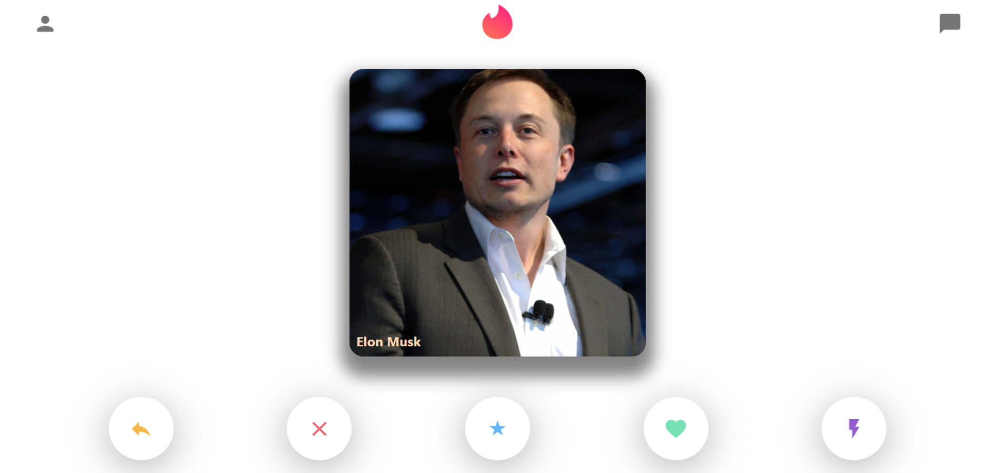

# Online Dating Service App - Design of [Tinder-Clone](https://tinder-clone-b6bc7.web.app)
 This app has no copyrights reserved, I've done it simply because I like the web design and seek to recreate it :)

 

## General Highlights of the Tinder-Clone App:
    
   |    Highlights                    |                         Description                                                                   |
   | :------------------------------: | ----------------------------------------------------------------------------------------------------- |  
   | **Responsive Design:**           | The App scalable with width and height change                                                              |
   | **Tinder Card Swipe:**           | Smooth Tinder UserInfo Card Left-and-Right Swiping Functionality[[1]](#fn_1)       |
   | **Live-Chat Functionality:**  | All chat messages has been stored in the Cloud Database Firestore and new sent messages would be pushed and stored into the database |
   | **Single-Page-App Build:** | All Component Switch is performed without page refresh with React-Router-Dom[[2]](#fn_2)     |   
 

## Languages and Tools:

   |    Syntax   |                         Description                              |
   | :---------: | :--------------------------------------------------------------: |  
   | Framework   | React.js with Hooks/Function Component                           |
   | Languages   | Javascript/CSS in BEM[[3]](#fn_3)/HTML|
   | Code Editor | Visual Studio Code                                               |
   | Hosting     | Firebase Hosting Service                                         |
   | Database    | Cloud Database Firestore                                         |

- *All code for this project could be found in the 'src' folder.*

 

## External Plugins 

      1. Material UI (User Interface Icons)
      2. React Router (Mobile Page Change without Refreshing)
      3. react-tinder-card demo (Card Swipe)
      4. Firebase (Database setup and data pulling)

 

## Components
 

## My Other Open Source Projects
 

## Footnodes

<b id="fn_1">[1]</b> - [↩](#footnode_1)  
<b id="fn_2">[2]</b> - [↩](#footnode_2)  
<b id="fn_3">[3]</b> BEM refers to the Block, Element, Modifier methodology which allows code to be scalable and reusable. [↩](#footnode_3)  

